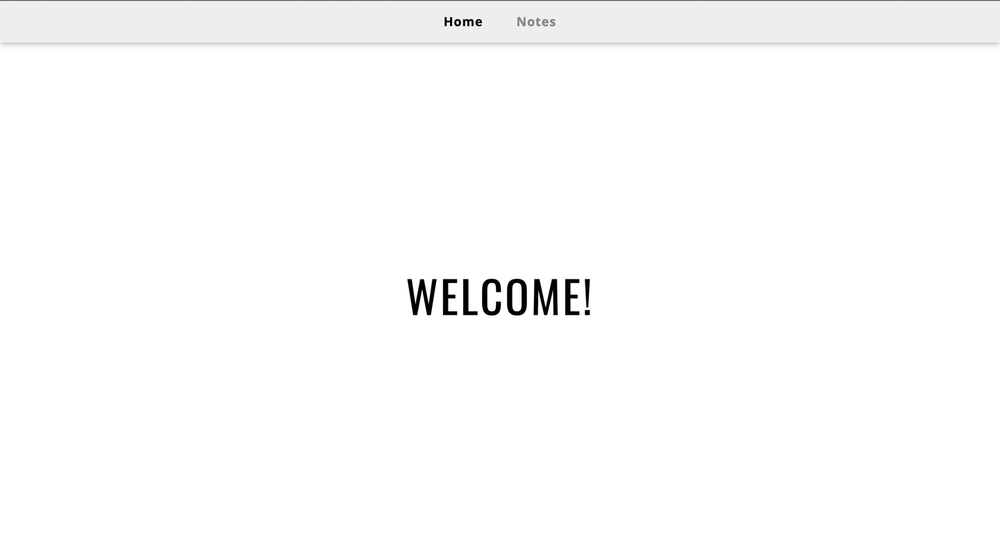
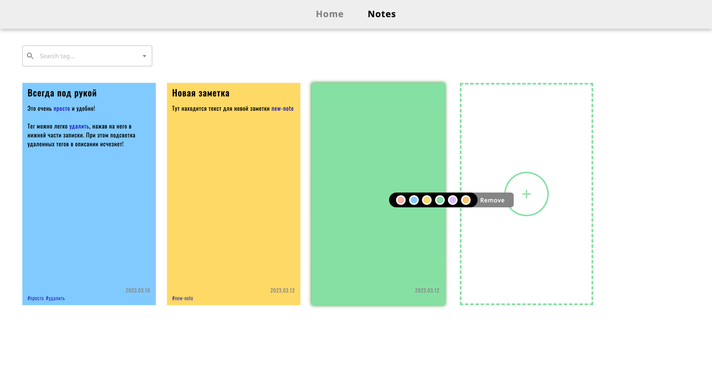

# Notes-app

**Technology stack:** TypeScript, Node.js, NestJS, PostgreSQL, Sequelize, React, Redux, React Router, MUI.

**Deployment Link::** https://notes-app-eight-pink.vercel.app/

## Description:

Notes-app is a web application designed to work with notes. As a result, SPA was implemented with two pages - Welcome Page and Notes Page. The Notes page contains:

- list of notes,
- the button for creating a new note,
- search bar to search for notes by tags.

The following functionality for working with notes is available to the user:

- creation,
- editing,
- deleting,
- changing the color,
- - dragging notes (changing the order of the queue),
- adding hashtags,
- removing hashtags.

## Описание: 

Notes-app - это веб-приложение предназначенное для работы с заметками. В результате было реализовано SPA с двумя страницами - Welcome Page и Notes Page. Страница Notes содержит:

- список заметок,
- кнопку создания новой заметки,
- search bar для поиска заметок по тегам.

Пользователю доступен следующий функционал по работе с заметками:

- создание,
- редактирование,
- удаление,
- изменение цвета,
- перетаскивание заметок (изменение опрядка очереди),
- добавление хэштегов,
- удаление хэштегов.

